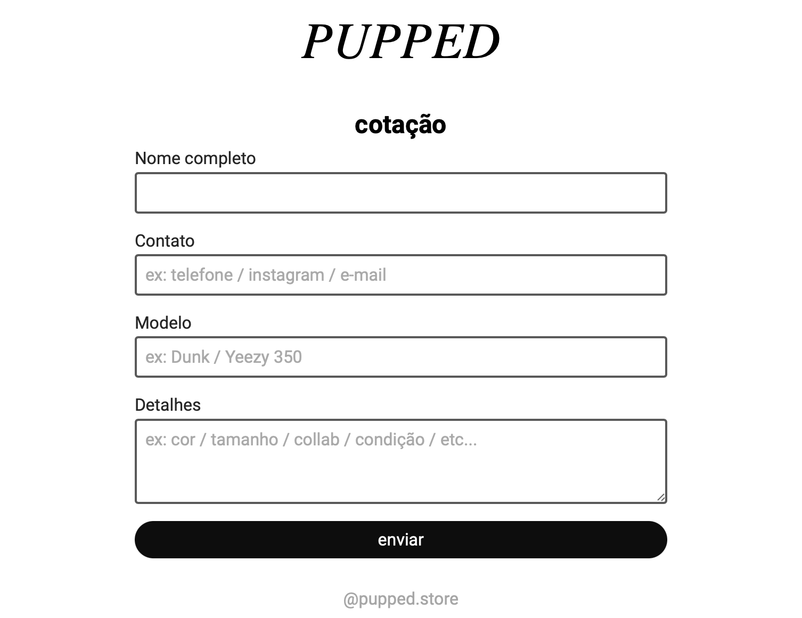
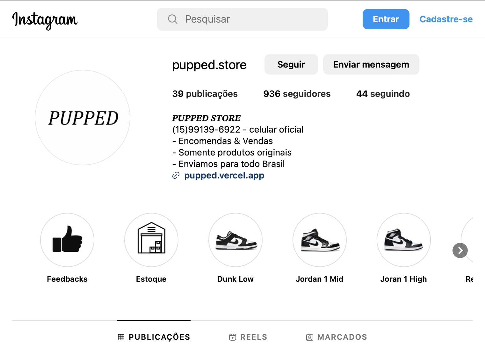

# Encomendas - PUPPED Store 📦👟

|  |  |
|-------------------------------------|------------------------------------|

Este é um projeto de um formulário de cotação para a PUPPED Store, onde os clientes podem solicitar informações sobre modelos de calçados e outros detalhes. ✨

## Como usar o formulário 📝

Para utilizar o formulário de cotação, siga os passos abaixo: 👇

1. Acesse a página da PUPPED Store através do link [https://www.instagram.com/pupped.store/](https://www.instagram.com/pupped.store/). 📱👟

2. No cabeçalho da página, você encontrará o logo da PUPPED Store, que é clicável e redireciona para a página do Instagram da loja. 🏠👟

3. O formulário está localizado no corpo da página, abaixo do cabeçalho. Ele possui os seguintes campos:

   - **Nome completo**: Insira o seu nome completo no campo fornecido. 🧑🏻‍💼
   - **Contato**: Insira o seu contato, que pode ser telefone, Instagram ou e-mail, no campo fornecido. 📱📧
   - **Modelo**: Informe o modelo do calçado que você deseja cotar, como Dunk ou Yeezy 350, por exemplo. 👟👟
   - **Detalhes**: Forneça detalhes adicionais sobre o calçado que você está buscando, como cor, tamanho, colaborações ou qualquer outra informação relevante. 📝🔍

4. Após preencher os campos obrigatórios, clique no botão "enviar" para submeter a cotação. 🚀📤

5. Caso a cotação seja enviada com sucesso, uma mensagem de confirmação será exibida na página, informando que a cotação foi enviada. 🎉✔️

6. Em caso de erro ou problemas no envio do formulário, uma mensagem de erro será exibida, indicando que não foi possível enviar a cotação. 😔❌

## Estilos e Design 🎨

O projeto utiliza HTML, CSS e JavaScript para criar a página e o formulário de cotação. A aparência da página é baseada em um design moderno e minimalista, com uso da fonte Roboto e uma paleta de cores composta por tons de preto, cinza e branco. ⚫⚪

O cabeçalho contém o logo da PUPPED Store, que é estilizado com uma fonte Cambria, itálico e negrito. O corpo da página possui o formulário de cotação com campos para nome, contato, modelo e detalhes. O botão de envio possui uma animação de destaque ao passar o mouse sobre ele. 🖱️✨

## Funcionalidades JavaScript 🧠🔧

O código JavaScript do projeto inclui duas principais funcionalidades:

1. **Visualização de imagem de referência**: O projeto possui uma funcionalidade para permitir aos usuários carregar uma imagem de referência do calçado que desejam cotar. No entanto, essa funcionalidade está atualmente comentada no código e desativada na página. Para ativá-la, basta descomentar as linhas apropriadas no arquivo `app.js`. 📷👀

2. **Envio do formulário**: O código JavaScript também é responsável por enviar os dados do formulário para um serviço de backend, utilizando o site 'getform.io'. Ao preencher o formulário e clicar no botão "enviar", os dados são coletados, formatados como JSON e enviados por meio de uma requisição POST ao endpoint do 'getform.io'. Caso o envio seja bem-sucedido, uma mensagem de confirmação é exibida. Em caso de erro, uma mensagem de erro é exibida. 🚀📤

## Próximos passos 🚀🔜

O próximo passo deste projeto será ativar o envio de imagens através do formulário. Assim, os clientes poderão enviar imagens de referência dos calçados desejados, proporcionando uma experiência ainda mais completa e personalizada. 📷👞

## Observações 📝🧐

Este projeto é um exemplo real de um formulário de cotação desenvolvido para a PUPPED Store, onde os clientes podem fazer suas encomendas de calçados. A funcionalidade de envio do formulário está configurada para utilizar o serviço 'getform.io' como backend para o recebimento dos dados. ⚠️🚫

## Autores 👩‍💻👨‍💻

Este projeto foi desenvolvido pela equipe da PUPPED Store, cujo link do Instagram pode ser encontrado no rodapé da página. 👥🏢
